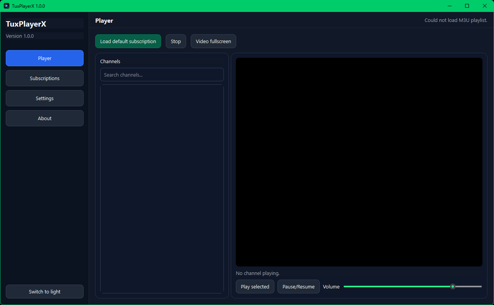
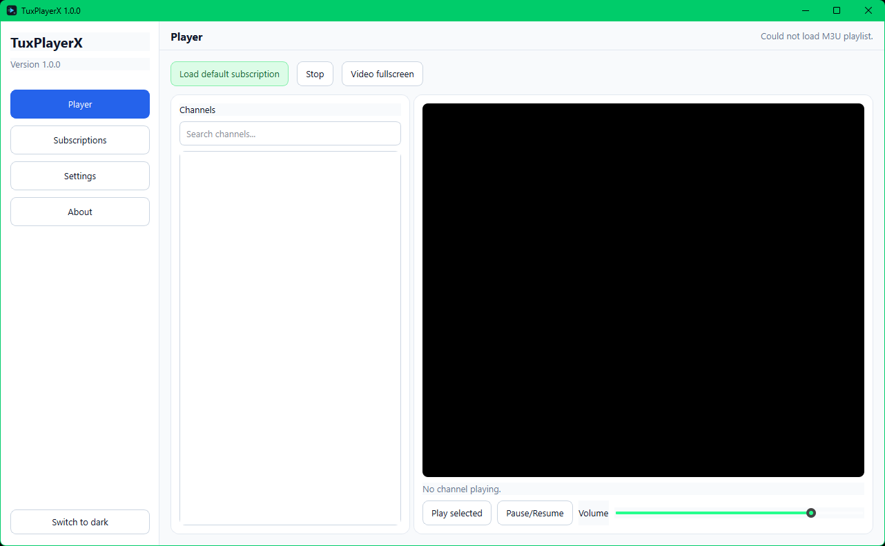
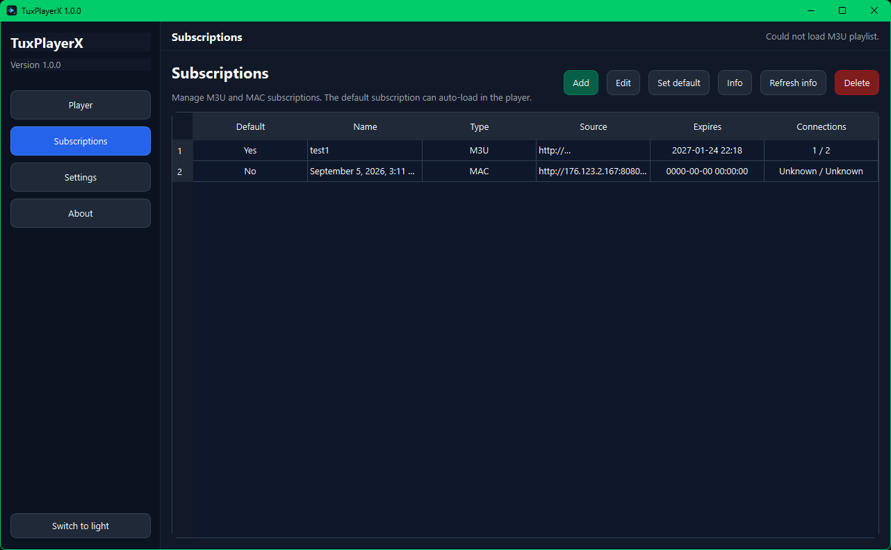
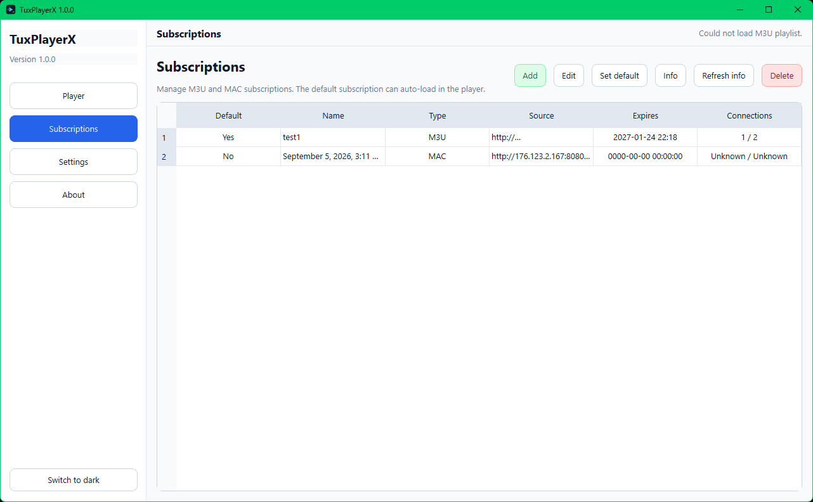
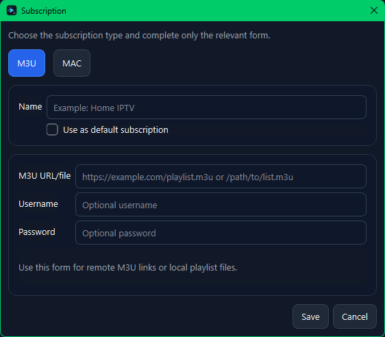
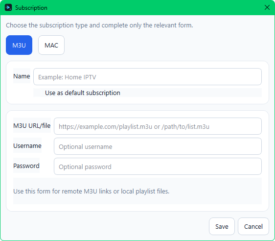
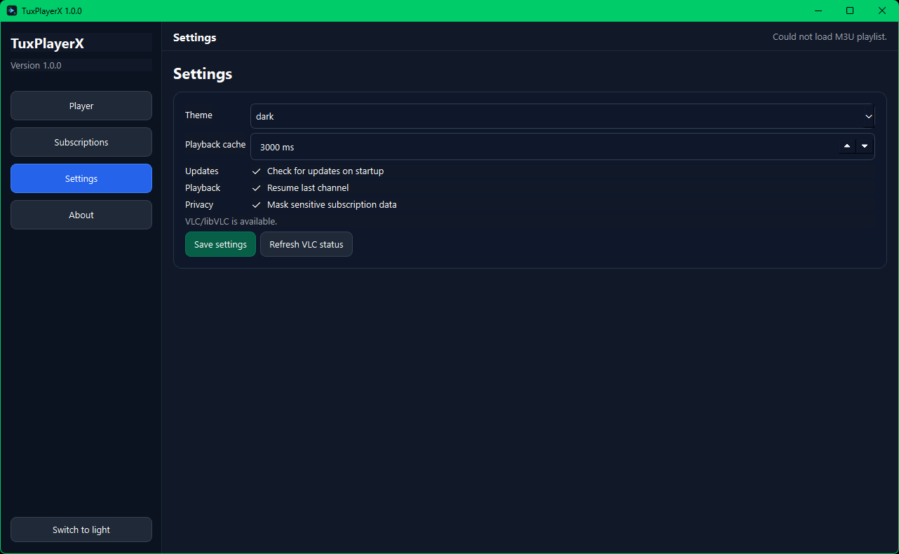
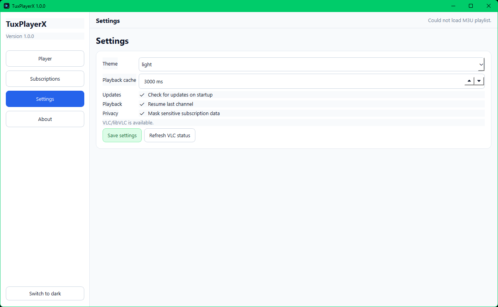
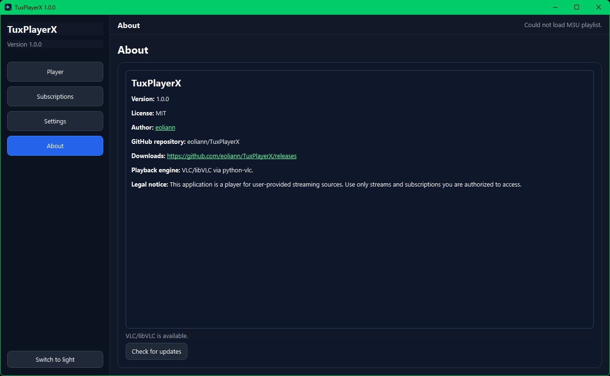
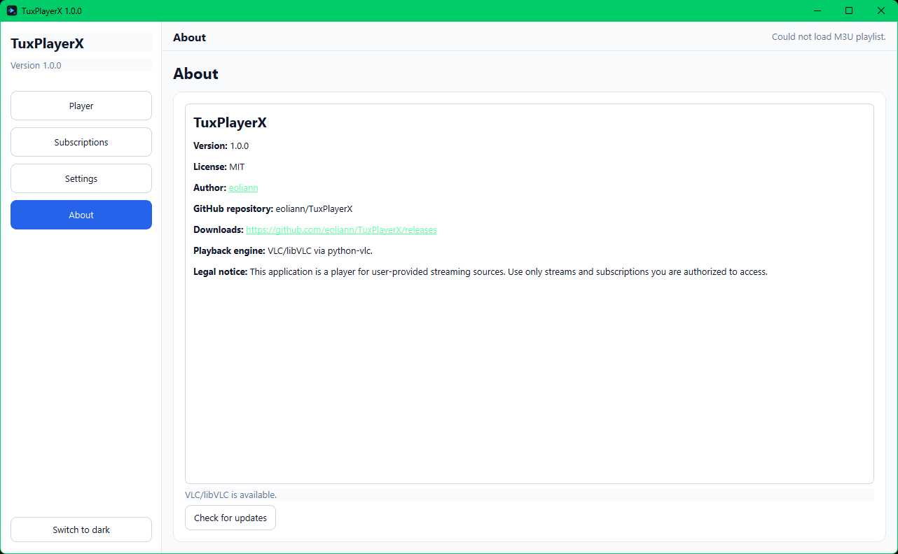

[](https://t.me/tuxpulse)
[](https://www.paypal.com/donate/?hosted_button_id=PTH2EXUDS423S)
[](http://revolut.me/adriannm9?style=plastic)


[](LICENSE.md)

# TuxPlayerX

**TuxPlayerX** is a desktop media player for user-provided IPTV/streaming sources. It supports M3U playlist subscriptions and authorized MAC portal subscriptions through VLC/libVLC playback.

The application does **not** include, sell, resell, host, or provide IPTV subscriptions, playlists, channels, media files, portal access, credentials, or streaming content.

> **Legal notice:** Use TuxPlayerX only with streams, playlists, portals, and subscriptions that you are legally authorized to access.

---

## Features

- M3U playlist playback
- Authorized MAC portal subscription support
- VLC/libVLC-based video playback
- Subscription manager
- Default subscription loading on startup
- Channel list and channel search
- Fullscreen video playback
- Dark theme by default
- Optional light theme
- Local SQLite storage
- GitHub release update check
- Linux `.deb` package build
- Windows `.exe` portable build
- Windows installer script through Inno Setup

---

## Screenshots

<p align="center">
  
  
</p>

<p align="center">
  
  
</p>

<p align="center">
  
  
</p>

<p align="center">
  
  
</p>

<p align="center">
  
  
</p>

---

## Requirements

### Linux

Recommended distributions:

- Debian-based distributions
- Ubuntu
- Linux Mint

Required runtime components:

- VLC
- libVLC
- Qt/XCB runtime libraries

When installing the `.deb` package with `apt`, required dependencies should be resolved automatically.

### Windows

Required runtime components:

- Windows 10 or Windows 11
- VLC Media Player installed on the system

TuxPlayerX uses VLC/libVLC for playback. If VLC is not installed, playback may not work.

---

## Installation

### Linux `.deb`

Download the latest `.deb` package from the Releases page, then install it with:

```bash
sudo apt install ./tuxplayerx_VERSION_amd64.deb
```

Replace `VERSION` with the downloaded version number.

Do not use `dpkg -i` unless you know how to manually fix missing dependencies. `apt install ./package.deb` is recommended because it can resolve dependencies automatically.

Start the application with:

```bash
tuxplayerx
```

### Windows portable `.exe`

Download the Windows build from the Releases page.

Run:

```text
TuxPlayerX.exe
```

Make sure VLC Media Player is installed before using playback features.

### Windows installer

Download and run:

```text
TuxPlayerXSetup-VERSION.exe
```

Follow the installer steps, then launch TuxPlayerX from the Start Menu or desktop shortcut.

---

## How to use TuxPlayerX

### 1. Add a subscription

Open the application and go to:

```text
Subscriptions
```

Click:

```text
Add
```

You will see two subscription types:

```text
M3U
MAC
```

Choose the type that matches your authorized subscription.

---

### 2. Add an M3U subscription

Select:

```text
M3U
```

Fill in:

- **Name**: a friendly name for the subscription
- **M3U URL/file**: the M3U playlist URL or local playlist path
- **Username**: optional, only if your provider uses it
- **Password**: optional, only if your provider uses it
- **Use as default subscription**: enable this if you want the subscription to load automatically when the app starts

Click:

```text
Save
```

If the M3U URL is based on an Xtream Codes-style API and includes valid username/password parameters, TuxPlayerX can try to read subscription information such as expiration date and active/max connections.

---

### 3. Add a MAC subscription

Select:

```text
MAC
```

Fill in:

- **Name**: a friendly name for the subscription
- **Portal URL**: the portal URL provided by your authorized provider
- **MAC address**: the MAC address assigned to your subscription
- **Use as default subscription**: enable this if you want the subscription to load automatically when the app starts

Click:

```text
Save
```

Some MAC/Stalker/Ministra portals use custom implementations. If your provider uses a non-standard API, a provider-specific adapter may be required.

---

### 4. Set a default subscription

Go to:

```text
Subscriptions
```

Select a subscription from the table and click:

```text
Set default
```

The default subscription is loaded automatically when TuxPlayerX starts.

---

### 5. Refresh subscription information

Go to:

```text
Subscriptions
```

Select the subscription and click:

```text
Refresh info
```

TuxPlayerX will try to display:

- subscription status
- expiration date
- active connections
- maximum allowed connections

If this information is not shown, the provider may not expose it through a supported API format.

---

### 6. Start a channel

Go to:

```text
Player
```

Load a subscription if it is not already loaded.

Then:

1. Search or scroll through the channel list.
2. Select a channel.
3. Double-click the channel or use the playback controls.

The stream will start in the video area.

---

### 7. Use fullscreen playback

Double-click the video area to enter fullscreen playback.

To exit fullscreen:

- press `Esc`, or
- double-click the video area again

---

## Build from source

### Linux development run

```bash
sudo apt update
sudo apt install -y python3-venv python3-pip vlc libvlc5
./run_dev.sh
```

### Build Linux `.deb`

```bash
chmod +x build_all.sh scripts/*.sh
./build_all.sh
```

The `.deb` package will be created in:

```text
dist/
```

### Build Windows `.exe`

Build the Windows executable on Windows, not on Linux.

```powershell
powershell -ExecutionPolicy Bypass -File scripts\build_windows.ps1
```

The portable executable will be created in:

```text
dist\TuxPlayerX\TuxPlayerX.exe
```

To build the Windows installer, install Inno Setup and compile:

```text
packaging\windows\tuxplayerx.iss
```

---

## Update system

TuxPlayerX can check the latest version through GitHub Releases.

Before publishing releases, check the values in:

```text
app/version.py
```

Example:

```python
APP_NAME = "TuxPlayerX"
APP_SLUG = "tuxplayerx"
APP_VERSION = "1.0.0"
APP_AUTHOR = "eoliann"
GITHUB_REPO = "eoliann/TuxPlayerX"
DOWNLOAD_URL = "https://github.com/eoliann/TuxPlayerX/releases"
AUTHOR_URL = "https://github.com/eoliann"
```

---

## What TuxPlayerX does not do

TuxPlayerX does not:

- provide IPTV subscriptions
- provide M3U playlists
- provide MAC portal access
- provide channels or media content
- host or redistribute streams
- bypass DRM
- bypass provider authentication
- bypass subscription restrictions
- guarantee that third-party streams will work

The user is responsible for using only authorized sources.

---

## Disclaimer

TuxPlayerX is provided for lawful playback of user-provided streaming sources.

The developer does not provide subscriptions, playlists, channels, media files, portal access, or credentials.

The developer is not responsible for:

- misuse of the application
- unauthorized access to third-party services
- provider account issues
- unavailable or unstable streams
- system damage caused by improper installation, modification, or use
- data loss, configuration loss, or other damages caused directly or indirectly by using the software

Use the software at your own risk.

---

## License

This project is licensed under the MIT License. See the `LICENSE` file for details.

---

## Author

Developed by **eoliann**.

GitHub profile:

```text
https://github.com/eoliann
```
