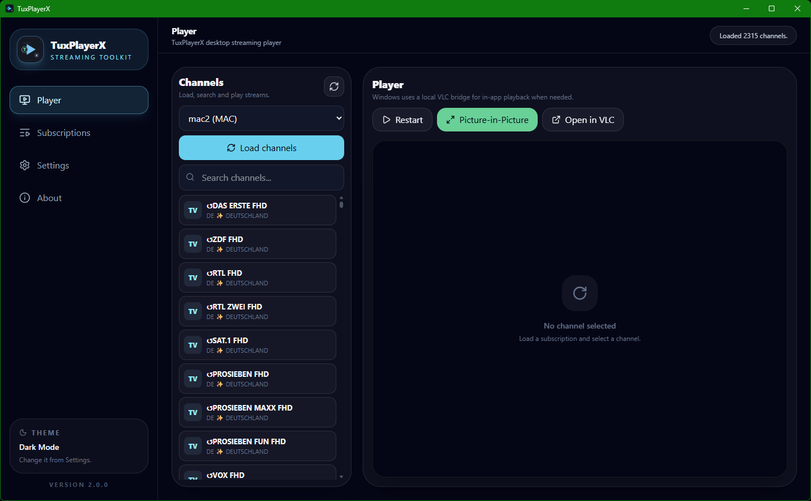
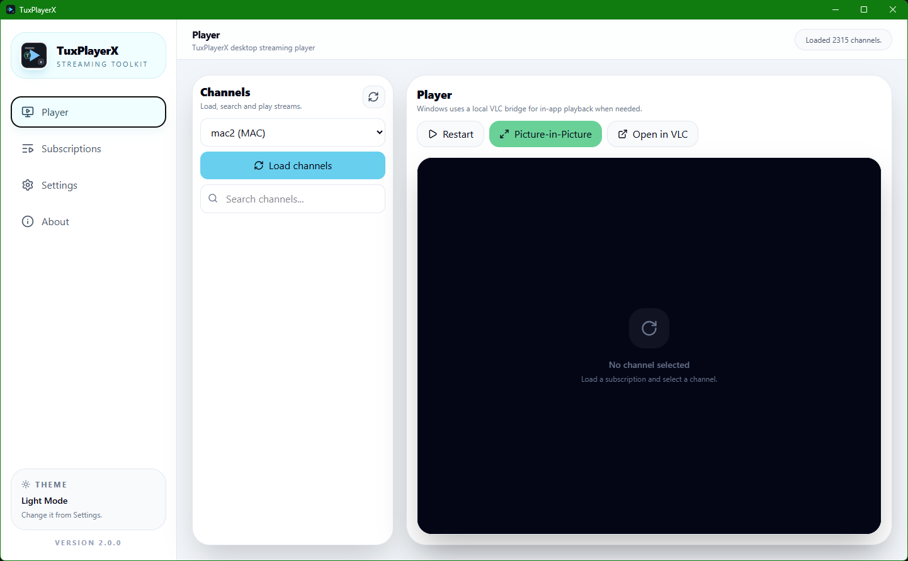
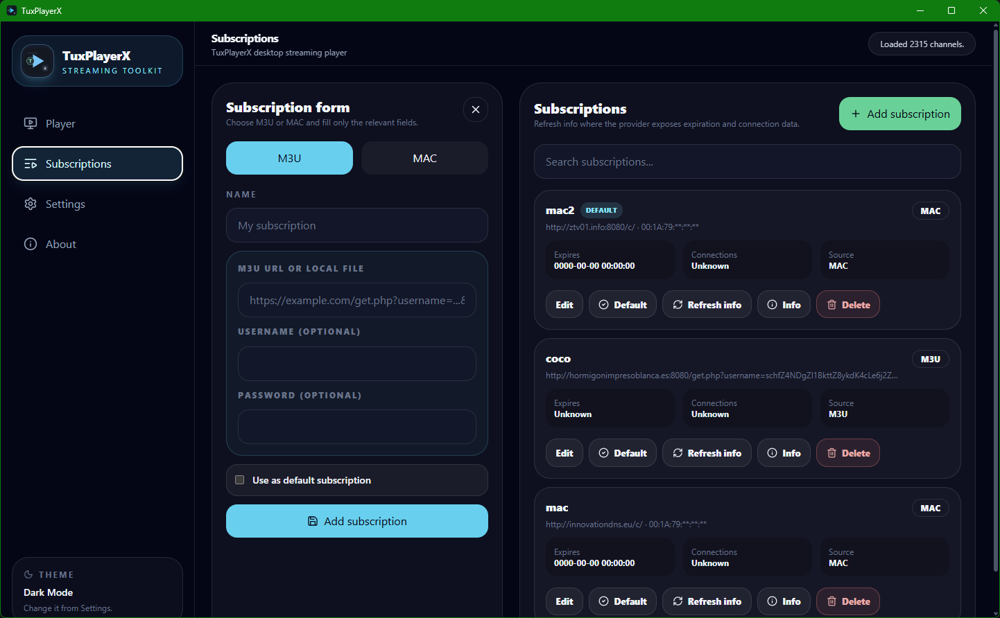
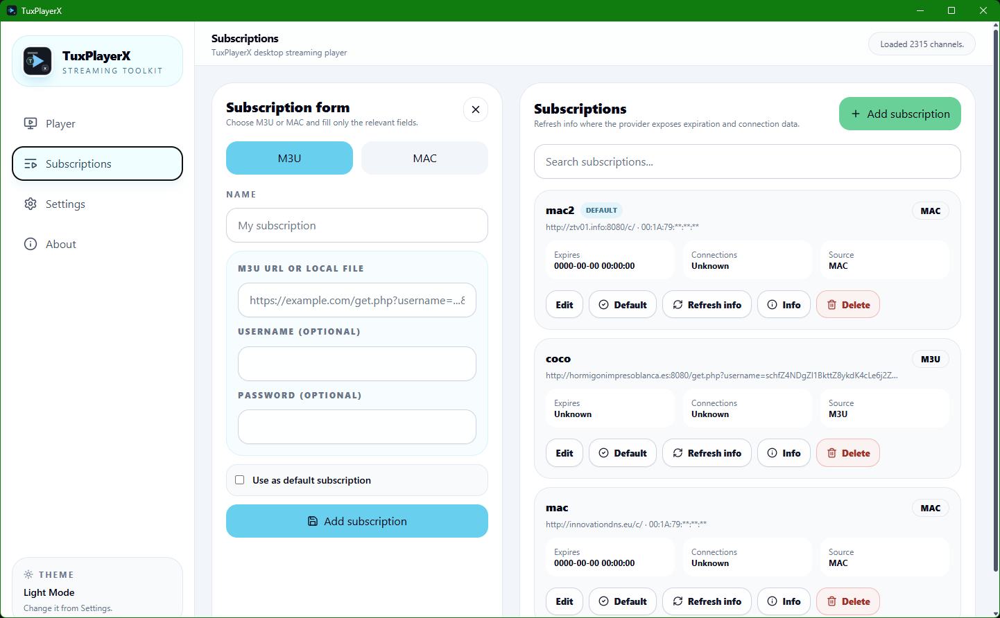
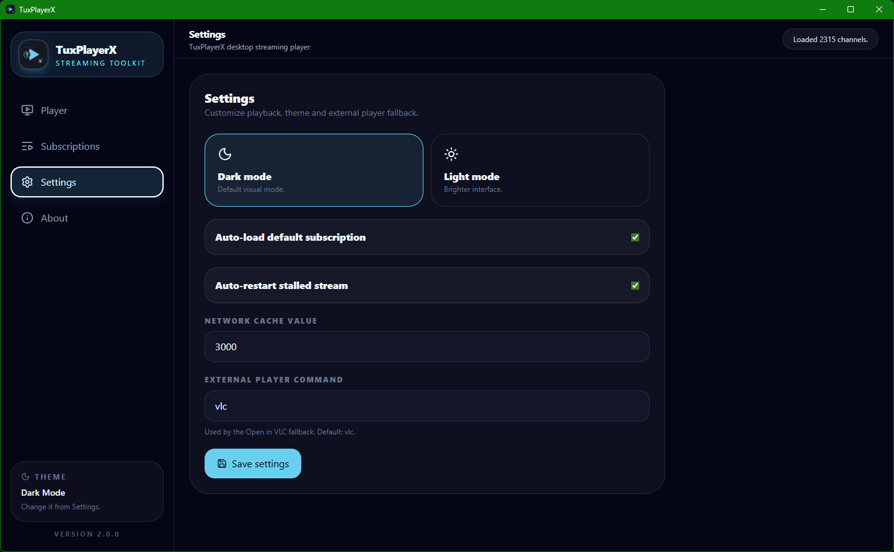
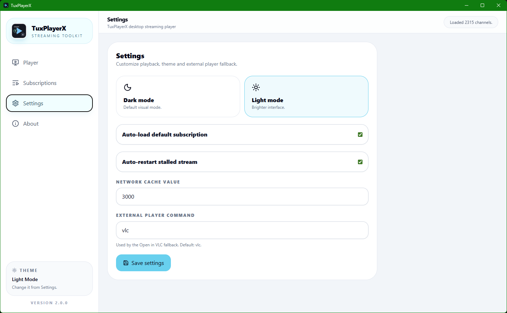
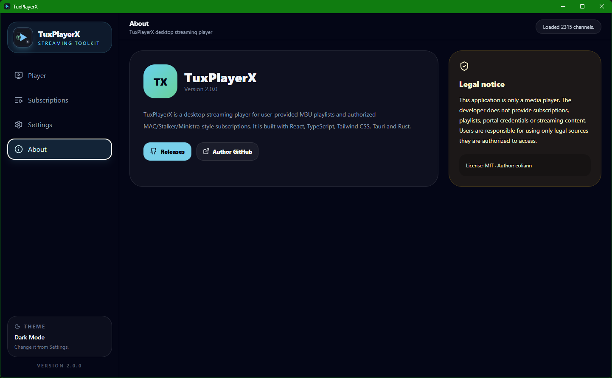
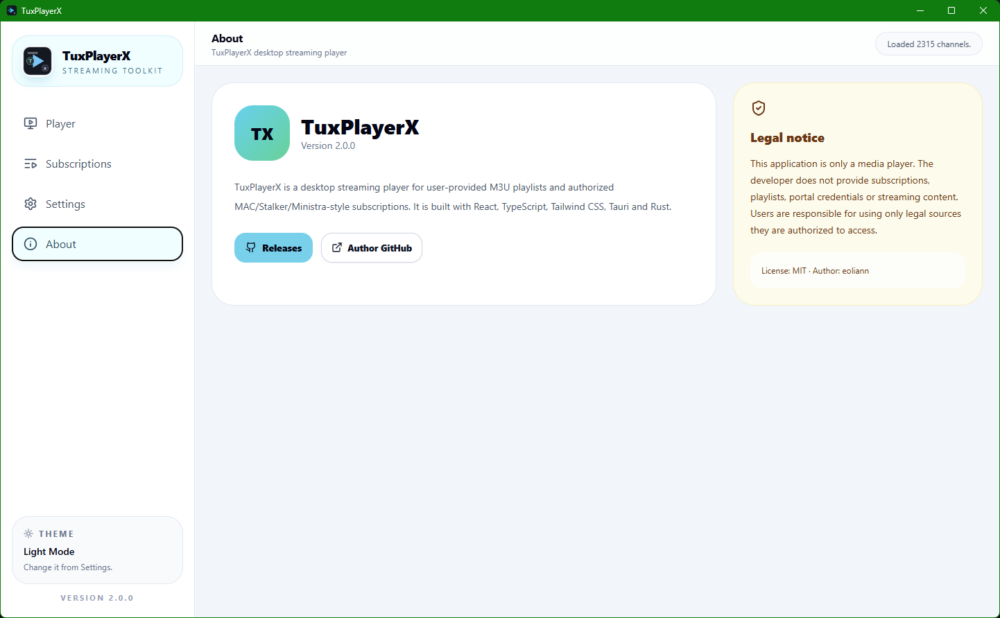

[](https://t.me/tuxpulse)
[](https://www.paypal.com/donate/?hosted_button_id=PTH2EXUDS423S)
[](http://revolut.me/adriannm9?style=plastic)


[](LICENSE.md)


# TuxPlayerX

TuxPlayerX Tauri is a redesigned desktop streaming player inspired by the visual system used in TuxPulse2.

It is built with **React**, **TypeScript**, **Tailwind CSS**, **Tauri v2** and a **Rust backend**.

> Legal notice: TuxPlayerX is only a media player. It does not provide, sell, host, distribute or promote IPTV subscriptions, playlists, MAC portal credentials, TV channels, movies, series or any streaming content. Use only sources you are authorized to access.

## Features

- Modern TuxPulse2-style interface
- Dark mode by default
- Optional full-application light mode
- M3U subscription management
- Authorized MAC/Stalker/Ministra-style subscription adapter
- Default subscription support
- Channel loading and search
- Subscription info refresh where supported by the provider
- HTML5/HLS video playback in the app window
- Detachable resizable Picture-in-Picture window
- Single active playback behavior: embedded playback stops when PiP or VLC is opened
- Always-on-top detached player window
- Optional external VLC fallback command
- Local SQLite storage handled by Rust
- GitHub-ready About page and release information

## Important playback note

This Tauri version uses the system WebView video engine plus `hls.js` for HLS streams. It will work best with `.m3u8`/HLS and browser-compatible streams.

Some IPTV streams that require VLC-specific demuxers/codecs may not play in the WebView. For those streams, use the **Open in VLC** fallback. A deeper embedded VLC backend can be added later, but it is more complex than the Python/PySide6 version.

## Screenshots

<p align="center">
  
  
</p>

<p align="center">
  
  
</p>

<p align="center">
  
  
</p>

<p align="center">
  
  
</p>

## Requirements

### Development

- Node.js 20+
- npm
- Rust and Cargo
- Tauri system dependencies

### Linux Tauri dependencies

See the official Tauri Linux prerequisites for your distro.

For Debian/Ubuntu/Linux Mint, the usual base set is similar to:

```bash
sudo apt update
sudo apt install -y \
  build-essential \
  curl \
  wget \
  file \
  libwebkit2gtk-4.1-dev \
  libayatana-appindicator3-dev \
  librsvg2-dev \
  patchelf
```

## Development run

```bash
npm install
npm run tauri:dev
```

## Production build

```bash
npm install
npm run tauri:build
```

Linux bundles are generated under:

```text
src-tauri/target/release/bundle/
```

Windows bundles are generated when building on Windows with:

```powershell
npm install
npm run tauri:build
```

## How to use

### Add an M3U subscription

1. Open **Subscriptions**.
2. Click **Add subscription**.
3. Select **M3U**.
4. Enter a display name.
5. Enter the M3U URL or local file path.
6. Optional: add username and password if your provider requires them.
7. Enable **Use as default** if needed.
8. Save the subscription.
9. Open **Player** and click **Load channels**.
10. Select a channel and click **Play**.

### Add a MAC subscription

1. Open **Subscriptions**.
2. Click **Add subscription**.
3. Select **MAC**.
4. Enter a display name.
5. Enter the portal URL.
6. Enter your authorized MAC address.
7. Enable **Use as default** if needed.
8. Save the subscription.
9. Open **Player** and click **Load channels**.
10. Select a channel and click **Play**.

MAC portal compatibility depends on the provider implementation. Some services may require adapter-specific changes.

### Use detached Picture-in-Picture

1. Start a channel in **Player**.
2. Click **Detach player**.
3. A separate always-on-top window opens.
4. The embedded player in the main window is stopped automatically.
5. Resize the detached window like a normal window.
6. Close it when finished.

### Use VLC fallback

1. Start a channel in **Player**.
2. Click **Open in VLC**.
3. TuxPlayerX opens the current stream in the configured external player.
4. The embedded player in the main window is stopped automatically so the stream remains active in only one place.

When you start a new channel in the main window, TuxPlayerX also closes the detached PiP window and stops the previously launched external player process where possible.

## License

MIT License.

## Disclaimer

This software is provided “as is”, without warranty of any kind. The developer is not responsible for system damage, data loss, misuse, illegal streaming sources, unavailable subscriptions, provider-side changes or playback issues caused by third-party services.


## Application icon

The Tauri icon set is synchronized with the original TuxPlayerX desktop icon, including the sidebar logo, window icon and bundled installer icons.

## Troubleshooting: Tauri permission/cache build error

If `npm run tauri:dev` fails with a message similar to:

```text
failed to read plugin permissions ... app_hide.toml: No such file or directory
```

clean the generated Rust/Tauri cache and run again:

```bash
./clean_tauri_cache.sh
npm run tauri:dev
```

This usually happens when a Tauri project was moved or copied from another path and the generated `src-tauri/target` cache still contains stale absolute paths.

## Layout update

The default desktop window starts larger and the Channels panel is more compact, giving the video player more room on first launch.

## Version management

The application version is managed manually in a single place:

```json
package.json -> version
```

Before development/build commands, `scripts/sync-version.mjs` automatically synchronizes this value to:

- `src-tauri/Cargo.toml`
- `src-tauri/tauri.conf.json`

The Rust backend reads the runtime version from Cargo using `env!("CARGO_PKG_VERSION")`, so do not hardcode the version in `src-tauri/src/main.rs`.

To change the version, edit only `package.json`, then run:

```bash
npm run sync:version
```

- Detach player opens a clean video-only PiP window
