[](https://t.me/tuxpulse)
[](https://www.paypal.com/donate/?hosted_button_id=PTH2EXUDS423S)
[](http://revolut.me/adriannm9?style=plastic)


[](LICENSE.md)

# TuxPlayerX

TuxPlayerX is a redesigned desktop and mobile streaming player.

It is built with **React**, **TypeScript**, **Tailwind CSS**, **Tauri v2** and a **Rust backend**.

> Legal notice: TuxPlayerX is only a media player. It does not provide, sell, host, distribute or promote IPTV subscriptions, playlists, MAC portal credentials, TV channels, movies, series or any streaming content. Use only sources you are authorized to access.

## Galery

<p align="center">
  Player
  <br>
  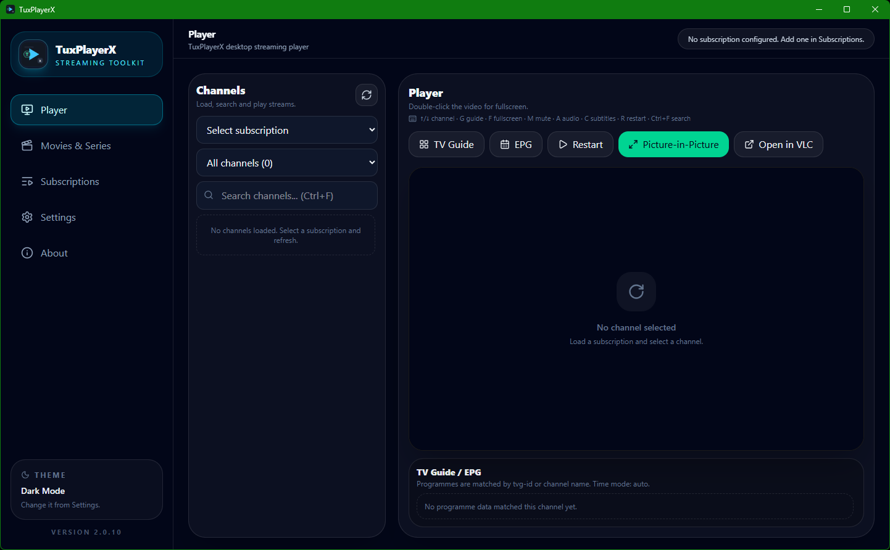
  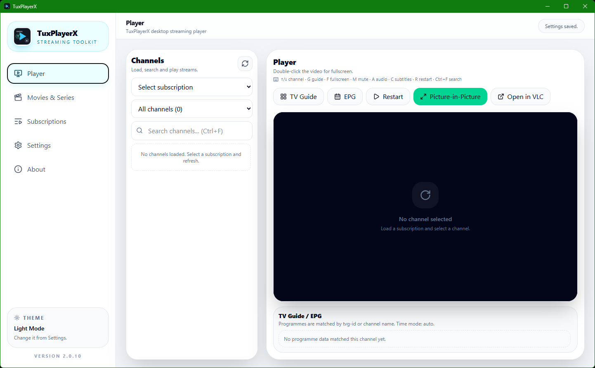
</p>
<p align="center">
  Subscriptions
  <br>
  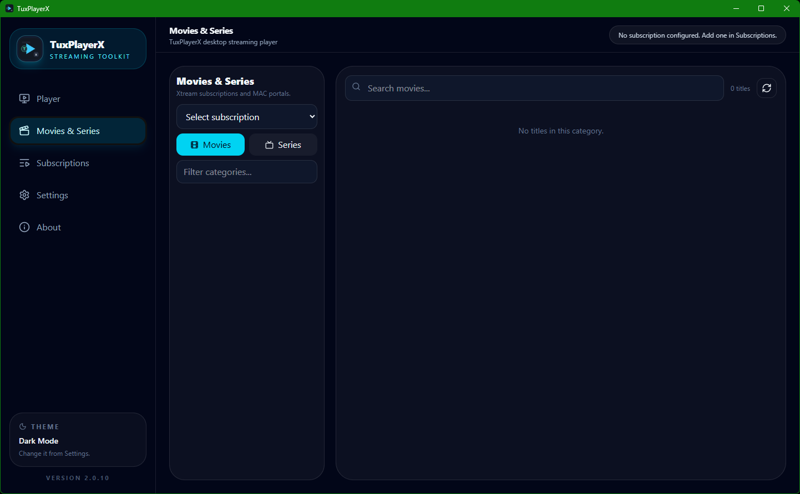
  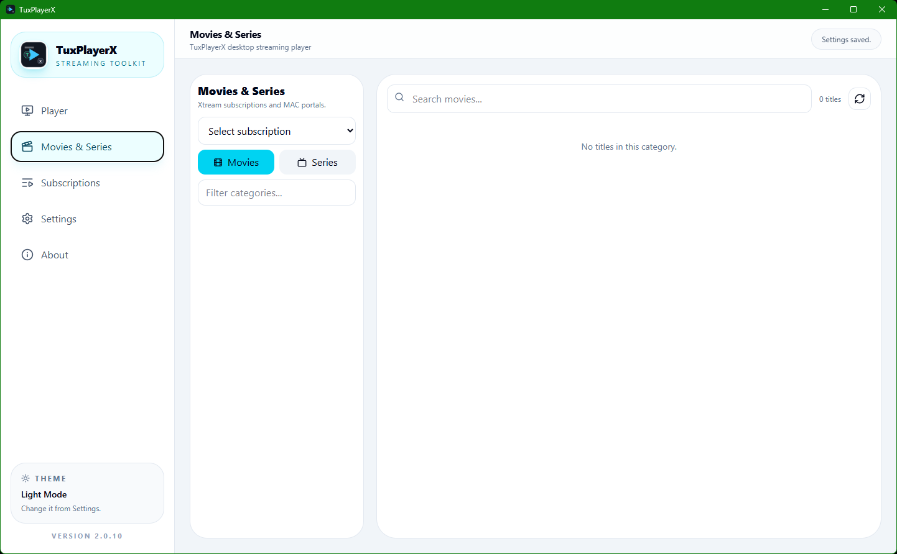
</p>
<p align="center">
  Settings
  <br>
  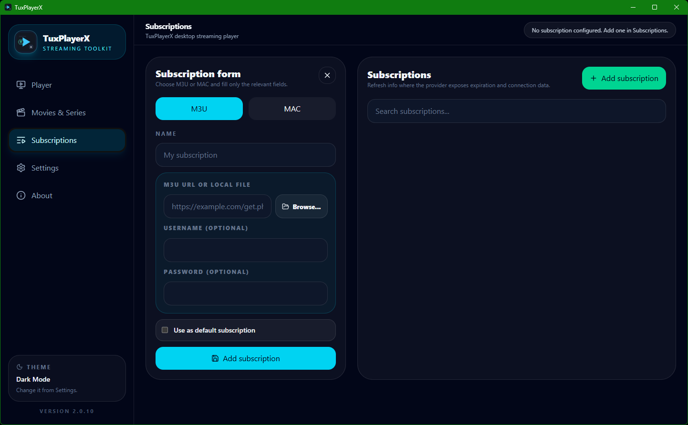
  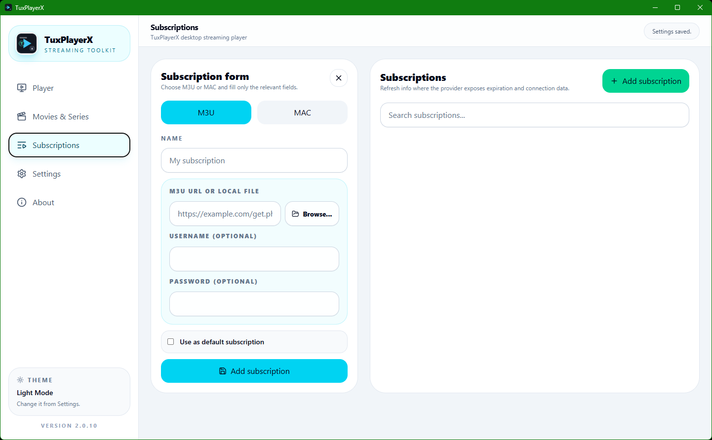
</p>
<p align="center">
  About
  <br>
  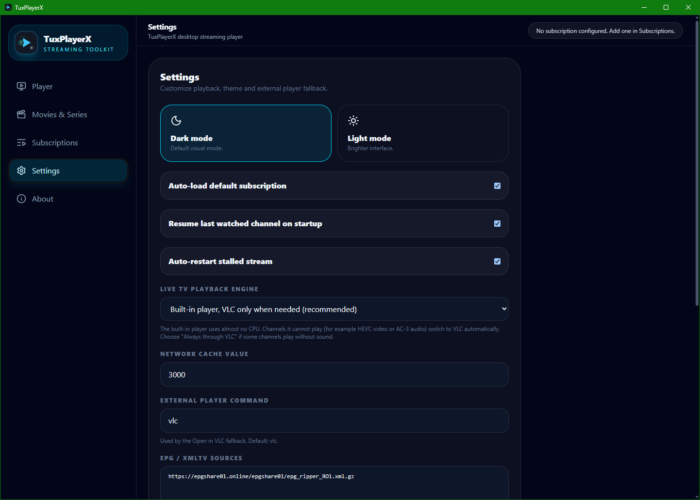
  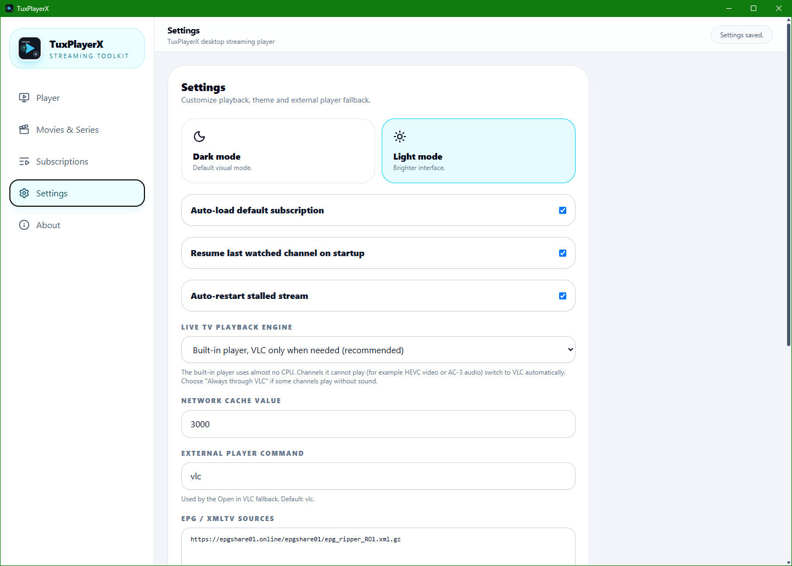
</p>
<p align="center">
  About
  <br>
  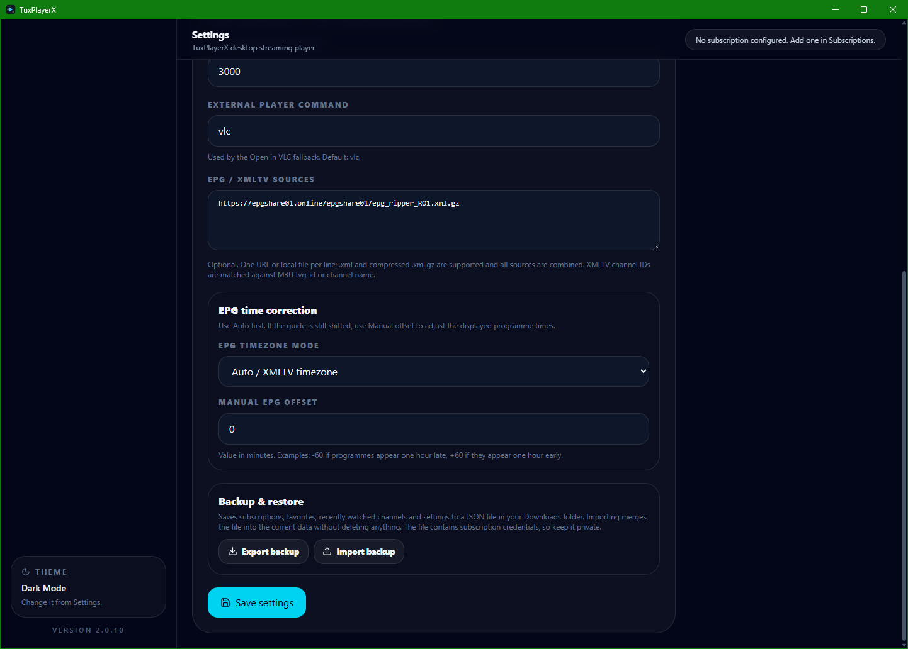
  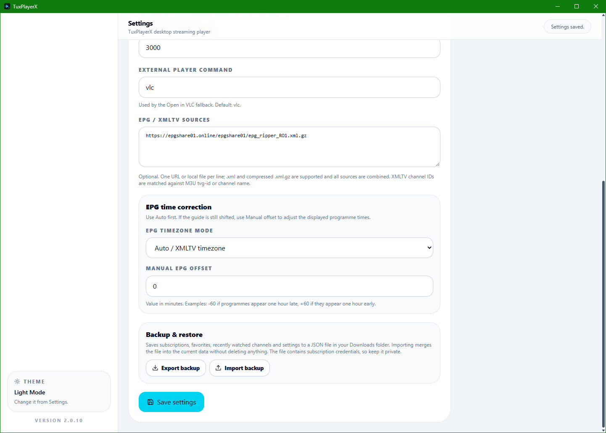
</p>
<p align="center">
  About
  <br>
  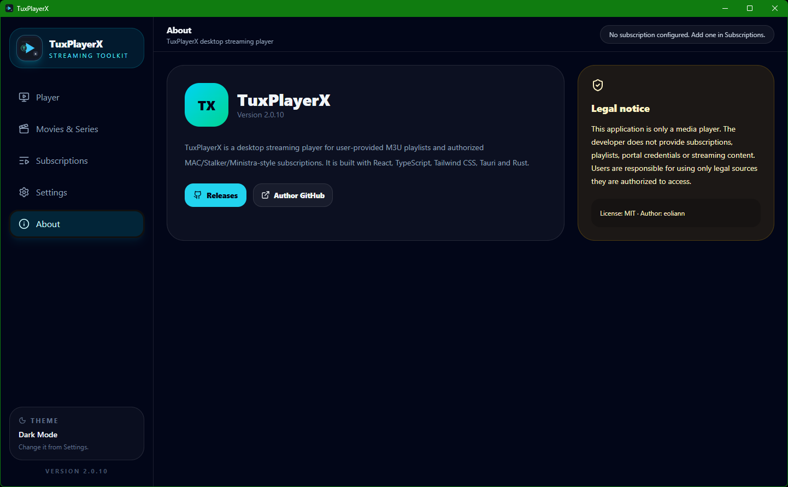
  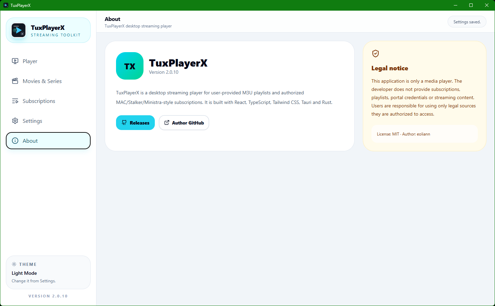
</p>

## Features

- Modern TuxPulse2-style interface
- Dark mode by default
- Optional full-application light mode
- M3U subscription management
- Authorized MAC/Stalker/Ministra-style subscription adapter
- Default subscription support
- Channel loading and search
- Fast channel list that stays smooth with very large playlists (only visible rows are rendered)
- Channel logos, category (group) filter, favorites and recently watched channels
- "Now playing" programme with progress bar in the channel list (when EPG is configured)
- Resume the last watched channel on startup (can be disabled in Settings)
- Keyboard shortcuts: ↑/↓ change channel, F fullscreen, M mute, R restart, Ctrl+F search
- Playback keeps running while browsing Subscriptions, Settings or About
- Channel lists are cached locally for 6 hours; the refresh button downloads them again
- XMLTV guide is downloaded once and kept in memory (refreshed every 6 hours or from the EPG button)
- MAC portal sessions are reused between channel switches for faster zapping
- Movies & Series (VOD) for Xtream subscriptions and MAC portals: categories, posters, search, seasons/episodes and resume where you left off
- Full TV guide grid (press G) with click-to-watch
- Catch-up / TV archive: replay past programmes on channels where the provider keeps an archive (Xtream `tv_archive` or M3U `catchup` attributes)
- Audio track and subtitle selection (A / C keys), with the preferred language remembered
- Volume and mute remembered between sessions
- Subscription expiry warning (7 days before) with automatic info refresh
- Several EPG sources (one per line), including compressed `.xml.gz` guides
- Backup & restore of subscriptions, favorites, recents and settings
- Subscription info refresh where supported by the provider
- HTML5/HLS video playback in the app window
- Detachable resizable Picture-in-Picture window
- Single active playback behavior: embedded playback stops when PiP or VLC is opened
- Always-on-top detached player window
- Optional external VLC fallback command
- Local SQLite storage handled by Rust
- GitHub-ready About page and release information

## Android app (phones, tablets, Android TV)

TuxPlayerX also runs on Android, from the same code base: the Rust backend (playlists, MAC portals, EPG, the local media proxy) is shared, and `src/mobile` holds a touch- and remote-friendly interface. The desktop interface lives in `src/desktop`, shared frontend code in `src/core`.

- **Live TV**: groups, search, favorites, recently watched and now-playing guide; a multi-column list or a compact logo grid for large playlists; full-screen player with channel up/down and a Fit/Fill switch.
- **TV guide and catch-up**: a full guide grid (channels down, time across); past programmes on channels with a TV archive replay from the guide or from the player's "Earlier" list.
- **Movies & Series**: poster grid, details, seasons and episodes, resume where you left off.
- **Subscriptions**: M3U URL, an M3U file from the device, or a MAC portal.
- **Android TV**: listed in the TV launcher; the remote's arrows move between items, OK selects, Channel +/− switches channels, Back closes the player.
- Rotating a phone to landscape plays the video full screen.

Android has its own version line and releases, tagged `android-vX.Y.Z`; each one carries `TuxPlayerX-android.apk`. To install it, download the APK on the device and allow installing apps from that source. On Android there is no VLC fallback: channels using formats the device cannot decode (some HEVC video or AC-3 audio) show a message.

Building the APK locally needs Android Studio (SDK and NDK), JDK 21 and Windows Developer Mode, then `npx tauri android build --apk`. The `build-android.yml` workflow builds and signs it on GitHub from the `ANDROID_KEYSTORE_BASE64`, `ANDROID_KEY_ALIAS` and `ANDROID_KEY_PASSWORD` secrets.

## Important playback note

This Tauri version uses the system WebView video engine plus `hls.js` for HLS streams. It will work best with `.m3u8`/HLS and browser-compatible streams.

Some IPTV streams that require VLC-specific demuxers/codecs may not play in the WebView. For those streams, use the **Open in VLC** fallback. A deeper embedded VLC backend can be added later, but it is more complex than the Python/PySide6 version.

Since 2.0.7 live channels play directly in the built-in player on Windows and Linux: a small local proxy in the Rust backend fetches the stream (adding the CORS headers the WebView needs and the `User-Agent` / `Referer` the playlist asks for), HLS goes to `hls.js` and MPEG-TS (most Xtream channels) to `mpegts.js`. Nothing is decoded or re-encoded outside the WebView, so CPU use stays very low.

Channels the built-in player cannot handle switch automatically to a local VLC bridge, which only remuxes the video and converts the audio to AAC; video is re-encoded to H.264 only when the codec still cannot be decoded (for example HEVC or MPEG-2). A channel that needed VLC goes straight to it the next time during the same session. **Settings → Live TV playback engine → Always through VLC** forces the bridge for every channel, which helps when some channels play without sound (AC-3 / MP2 audio).

Stream headers are read from `http-user-agent` / `http-referrer` attributes, `#EXTVLCOPT:` lines, Kodi-style `#EXTHTTP:{...}` lines and `url|User-Agent=...&Referer=...` suffixes, and are also passed to VLC.

The player reconnects automatically with increasing delays and stops after 5 failed attempts, so an offline channel does not keep using resources.

## Requirements

### Development

- Node.js 20+
- npm
- Rust and Cargo
- Tauri system dependencies

### Linux Tauri dependencies

See the official Tauri Linux prerequisites for your distro.

For Debian/Ubuntu/Linux Mint, the usual base set is similar to:

```bash
sudo apt update
sudo apt install -y \
  build-essential \
  curl \
  wget \
  file \
  libwebkit2gtk-4.1-dev \
  libayatana-appindicator3-dev \
  librsvg2-dev \
  patchelf
```

## Development run

```bash
npm install
npm run tauri:dev
```

## Production build

```bash
npm install
npm run tauri:build
```

Linux bundles are generated under:

```text
src-tauri/target/release/bundle/
```

Windows bundles are generated when building on Windows with:

```powershell
npm install
npm run tauri:build
```

## How to use

### Add an M3U subscription

1. Open **Subscriptions**.
2. Click **Add subscription**.
3. Select **M3U**.
4. Enter a display name.
5. Enter the M3U URL, or click **Browse...** to choose a local `.m3u` / `.m3u8` file (the name is filled in from the file name if empty). Local files are read again each time channels are reloaded, so edits to the file are picked up; UTF-8 and older Latin-1 playlists are both supported.
6. Optional: add username and password if your provider requires them.
7. Enable **Use as default** if needed.
8. Save the subscription.
9. Open **Player** and click **Load channels**.
10. Select a channel and click **Play**.

### Add a MAC subscription

1. Open **Subscriptions**.
2. Click **Add subscription**.
3. Select **MAC**.
4. Enter a display name.
5. Enter the portal URL.
6. Enter your authorized MAC address.
7. Enable **Use as default** if needed.
8. Save the subscription.
9. Open **Player** and click **Load channels**.
10. Select a channel and click **Play**.

MAC portal compatibility depends on the provider implementation. Some services may require adapter-specific changes.

### Use detached Picture-in-Picture

1. Start a channel in **Player**.
2. Click **Detach player**.
3. A separate always-on-top window opens.
4. The embedded player in the main window is stopped automatically.
5. Resize the detached window like a normal window.
6. Close it when finished.

### Use VLC fallback

1. Start a channel in **Player**.
2. Click **Open in VLC**.
3. TuxPlayerX opens the current stream in the configured external player.
4. The embedded player in the main window is stopped automatically so the stream remains active in only one place.

When you start a new channel in the main window, TuxPlayerX also closes the detached PiP window and stops the previously launched external player process where possible.

## License

MIT License.

## Disclaimer

This software is provided “as is”, without warranty of any kind. The developer is not responsible for system damage, data loss, misuse, illegal streaming sources, unavailable subscriptions, provider-side changes or playback issues caused by third-party services.


## Application icon

The Tauri icon set is synchronized with the original TuxPlayerX desktop icon, including the sidebar logo, window icon and bundled installer icons.

## Troubleshooting: Tauri permission/cache build error

If `npm run tauri:dev` fails with a message similar to:

```text
failed to read plugin permissions ... app_hide.toml: No such file or directory
```

clean the generated Rust/Tauri cache and run again:

```bash
./clean_tauri_cache.sh
npm run tauri:dev
```

This usually happens when a Tauri project was moved or copied from another path and the generated `src-tauri/target` cache still contains stale absolute paths.

## Layout update

The default desktop window starts larger and the Channels panel is more compact, giving the video player more room on first launch.

## Version management

The application version is managed manually in a single place:

```json
package.json -> version
```

Before development/build commands, `scripts/sync-version.mjs` automatically synchronizes this value to:

- `src-tauri/Cargo.toml`
- `src-tauri/tauri.conf.json`

The Rust backend reads the runtime version from Cargo using `env!("CARGO_PKG_VERSION")`, so do not hardcode the version in `src-tauri/src/main.rs`.

To change the version, edit only `package.json`, then run:

```bash
npm run sync:version
```

- Detach player opens a clean video-only PiP window

## EPG / TV Guide

TuxPlayerX supports XMLTV EPG sources.

To enable TV programme guide data:

1. Open **Settings**.
2. Paste your XMLTV EPG URL or local XMLTV file path in **EPG / XMLTV URL**.
3. Click **Save settings**.
4. Open **Player** and start a channel.
5. The **TV Guide / EPG** panel below the video will show available programmes for the selected channel.

EPG matching is done using, in this order:

- M3U `tvg-id`, when available;
- MAC portal EPG/channel IDs, when available;
- channel name matching against XMLTV `display-name`.

If no data appears, verify that the XMLTV channel IDs or display names match the channel names from your playlist/provider.
## EPG / TV Guide time correction

TuxPlayerX supports XMLTV EPG sources. In **Settings**, add the XMLTV URL and choose the EPG time mode:

- **Auto / XMLTV timezone**: reads XMLTV timezone offsets and displays programme times in the local system timezone.
- **Treat EPG times as local time**: ignores XMLTV offsets and treats programme times as local.
- **Manual offset**: applies a correction in minutes when a guide source is consistently shifted.

For example, use `-60` if programmes appear one hour too late, or `+60` if they appear one hour too early.

